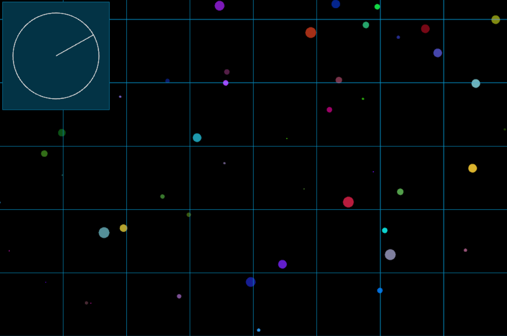

# Starfyld
A simple Python/Pyglet/OpenGL starfield simulation. With a togglable overlay giving it a sci-fi vibe. It's pretty.

## Controls
- h: toggle the "HUD"/ overlay elements for a more screensaver-like feel. 
- Esc: Quit the application
- Arrow keys: Increase/decrease an additional force multiplier in corrosponding x/y direction

## How does it work?

Uses OpenSimplex noise to gently sway some circles (stars) around in a smooth but pseudorandom way. 
Bigger circles move faster to cheaply emulate parallax. 
The shapes move around rather than moving the camera view! 
The "radar" circle on the top-left is just tracking the overall direction of the noise-based motion. 

## Why? 

I wanted something to put on a second monitor I wasn't really using. Then this happened. 

## Can I add to this?

Please do, I'm out of ideas and terrible at structuring graphics code, and I'm sure it could be much cooler!